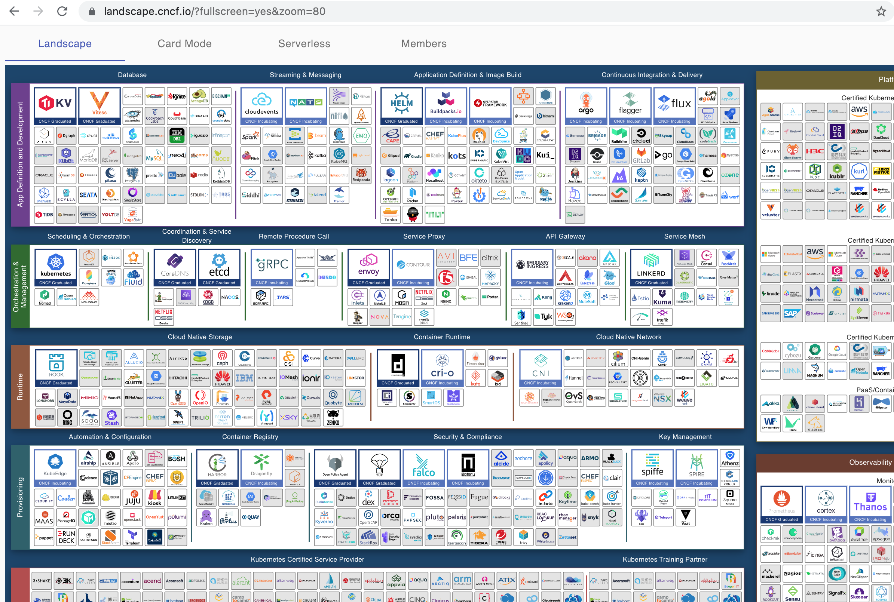

# IT Zajednica Rijeka
## Cloud-native App Development
### Filip Pravica
10.09.2021

---
# What is cloud native
- Cloud Native Computing Foundation (CNCF) 
  - Cloud Native is about scale and resilience
  - Distributed systems capable of scaling to tens of thousands of self healing multi-tenant nodes

_www.cncf.io_

---
# What is cloud native 2
- Technologies such as:
  -  containers
  -  microservices 
  -  serverless functions
  -  immutable infrastructure
- but not only a technology or a tool set
- it is a philosophy, culture and strategy

---
# What isn't cloud native
- moving exsisting workloads to the servers rented from the cloud provider
- copying the same hardware network setup principles to the cloud
- not using cloud security policies

---
# Cloud native engineer
- increasing in demand in the last 2 years
- ground-floor opportunity
- junior dev vs. senior dev
- small agency vs. legacy enterprise providers

---
# Where to start
- learn docker basics
- play with orcherstration
  - docker-compose
  - kubernetes (minikube)
- check out the cloud providers
  - API gateways
  - serverless functions
  - static websites
  - ci/cd, databases, messaging

---
# Where to continue
- event-driven architecture
- cloud native patterns
- serverles workflows
- specialize 

---
# How it started...
- Kubernetes 1.0 donated to Linux Foundation by Google
- In 2015 Cloud Native Computing Foundation
- 20 founding members to help advance container technology
-  Google, CoreOS, Mesosphere, Red Hat, Twitter, Huawei, Intel, Cisco, IBM, Docker, Univa, and VMware

---
# How it's going...
- today more than 500 members
- a huge landscape
- main fields:
  - app definition and developemnt
  - orcherstration and management
  - runtime
  - provisioning
  - observability and analysis

_...imagine a fullstack dev here ;)_

---
  

---
# CNCF 
- www.cncf.io
- landscape.cncf.io
- radar.cncf.io

